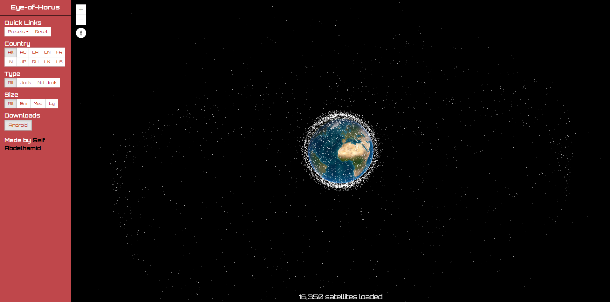

# 👁️ Eye of Horus

**Eye of Horus** is a computer vision-powered security and surveillance system designed to intelligently monitor environments, detect motion or anomalies, and optionally send alerts or log events. It leverages modern image processing techniques and AI-based detection.

---

## 🔍 Features

- 🎯 Real-time motion detection
- 🧠 AI-powered object/person recognition (optional)
- 🖼️ Camera input streaming and frame capture
- 📦 Event logging and alert system
- 🔧 Configurable detection thresholds and modes

---

## 🧰 Tech Stack

- **Python**
- **OpenCV** – image processing and motion detection
- **Flask** or **FastAPI** (if web-based interface)
- (Optional) **TensorFlow**, **YOLO**, or **MediaPipe** for AI inference
- **SQLite** or local file storage for logs

---

## 📦 Installation

```bash
git clone https://github.com/Seif-Abdelhamid/Eye-of-horus.git
cd Eye-of-horus
pip install -r requirements.txt
```

---

## ⚙️ Configuration

You may need to update the config file or parameters in the script:

```
CAMERA_SOURCE=0
MOTION_SENSITIVITY=0.8
SAVE_EVENTS=True
```

Check `config.py` or any constants defined in the main script for customization.

---

## ▶️ Running the App

```bash
python main.py
```

Depending on the implementation, this will start a video stream from your webcam and display a live feed with motion detection overlays.

---

## 📁 Project Structure

```
Eye-of-horus/
├── main.py              # Main entry script
├── detection/           # Detection and processing logic
├── utils/               # Helper modules (logging, file handling)
├── config.py            # Configuration and parameters
├── requirements.txt
└── README.md
```

---

## 📷 Output

The system can be configured to:

- Draw bounding boxes on motion
- Save event frames
- Log timestamps
- Send notifications (e.g. via email or SMS)

<p align="center">
  
</p>
---

## 🤖 Possible Extensions

- Face recognition for known/unknown user access
- Integration with smart home systems
- Remote viewing via web interface or mobile app
- Cloud storage or database for analytics


## 👤 Author

**Seif Abdelhamid**  
GitHub: [@Seif-Abdelhamid](https://github.com/Seif-Abdelhamid)
